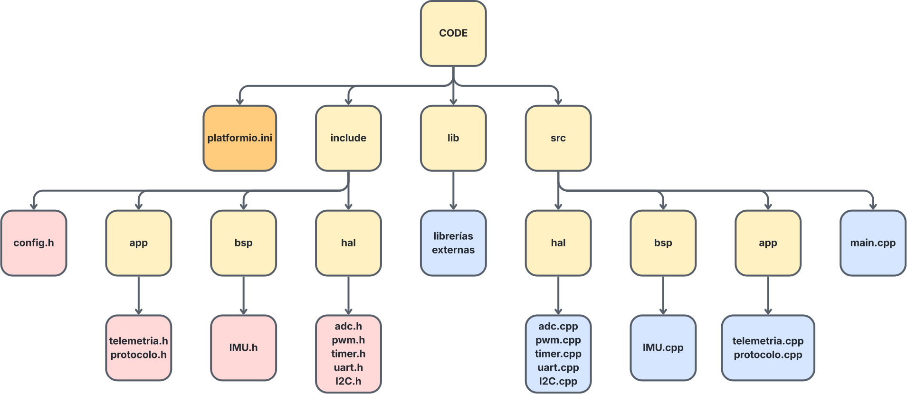

# Firmware basado en RTOS con ESP32
Este repositorio pertenece a la segunda práctica de laboratorio de comunicaciones IoT, en la cual, se ha desarrollado una pequeña aplicación que hace de forma simultaneas distintas tareas. Como sistema operativo se ha utilizado FreeRTOS y se muestra a continuación un ejemplo de la implementación del mismo en el fichero `tareas.cpp`.

## P2_2_IMU

Añade una tarea que lee el BNO055 cada 100 ms y envía una línea con seis medidas cada diez lecturas por terminal serial respecto al P2_1. Si el sensor no se inicializa, la tarea no se crea. En conjunto con las lecturas del IMU se envía cada segundo por UART un mensaje que pone "Hola mundo" al mismo tiempo que hace parpadear un led cada 200ms.

Código de [`P2_2_IMU/src/app/tareas.cpp`](P2_2_IMU/src/app/tareas.cpp):

```cpp
#include <Arduino.h>
#include <freertos/FreeRTOS.h>
#include <freertos/task.h>
#include <freertos/semphr.h>
#include "sensors/BNO055.h"

static DatosBNO055 ultimaIMU{};
static SemaphoreHandle_t mutexIMU = nullptr;

// Lee el sensor cada 100 ms y actualiza el dato compartido.
void task_read_IMU(void *parameter) {
    TickType_t inicio = xTaskGetTickCount();

    while (true) {
        DatosBNO055 datos = leerBNO055();  // Lectura I2C fuera del mutex

        xSemaphoreTake(mutexIMU, portMAX_DELAY);
        ultimaIMU = datos;
        xSemaphoreGive(mutexIMU);

        // Calcula el periodo en el cual se tiene que ejecutar la siguiente tarea
        // teniendo en cuenta cuanto ha tardado en ejecutarse esta tarea.
        vTaskDelayUntil(&inicio, pdMS_TO_TICKS(100));
    }
}

// Cada segundo copia la última muestra y la muestra por Serial.
void task_print_IMU(void *parameter) {
    TickType_t inicio = xTaskGetTickCount();

    while (true) {
        vTaskDelayUntil(&inicio, pdMS_TO_TICKS(1000));

        DatosBNO055 datos;
        xSemaphoreTake(mutexIMU, portMAX_DELAY);
        datos = ultimaIMU;
        xSemaphoreGive(mutexIMU);

        Serial.printf("%.2f;%.2f;%.2f;%.2f;%.2f;%.2f\n",
                      datos.rumbo, datos.roll, datos.pitch,
                      datos.accX, datos.accY, datos.accZ);
    }
}

// Se llama una vez desde setup(), después de Serial.begin().
void init_task_read_IMU() {
    if (!initBNO055()) return;

    mutexIMU = xSemaphoreCreateMutex();
    if (mutexIMU == nullptr) return;

    xTaskCreate(task_read_IMU,  "READ_IMU",  4096, nullptr, 2, nullptr);
    xTaskCreate(task_print_IMU, "PRINT_IMU", 4096, nullptr, 1, nullptr);
}
```
En el código anterior se crea un mutex, un tipo de semáforo que permite que solo una tarea acceda a `ultimaIMU` en cada momento. Antes de leer o actualizar la estructura, cada tarea solicita el mutex con `xSemaphoreTake()`. Si la otra tarea lo está usando, espera hasta que quede libre. Al terminar la copia, lo libera con `xSemaphoreGive()`.

Esto evita que `task_print_IMU` lea los datos mientras `task_read_IMU` los está actualizando. El mutex no impide que el sistema cambie de tarea, si no que protege el acceso a los datos compartidos para que siempre se copie una muestra completa. Además, se libera antes de imprimir por Serial para no mantener bloqueada la tarea de lectura durante la transmisión.
## Arquitectura del proyecto

<picture>
  <source media="(prefers-color-scheme: dark)"
          srcset="doc/img/ESQUEMA_OSCURO.svg">
  <source media="(prefers-color-scheme: light)"
          srcset="doc/img/ESQUEMA_CLARO.svg">
  
</picture>


- `src/app/tareas.cpp`: funciones de tarea y creación con `xTaskCreate()`.
- `src/hal/LED.cpp`: control del LED.
- `src/sensors/BNO055.cpp`: lectura del sensor en la práctica con IMU.
- `include/`: declaraciones y configuración.
